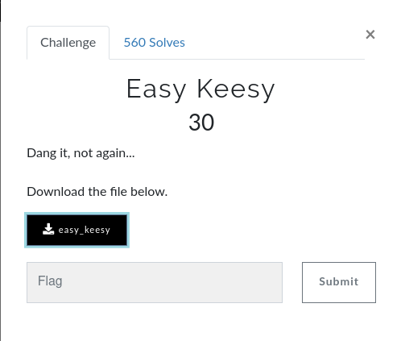
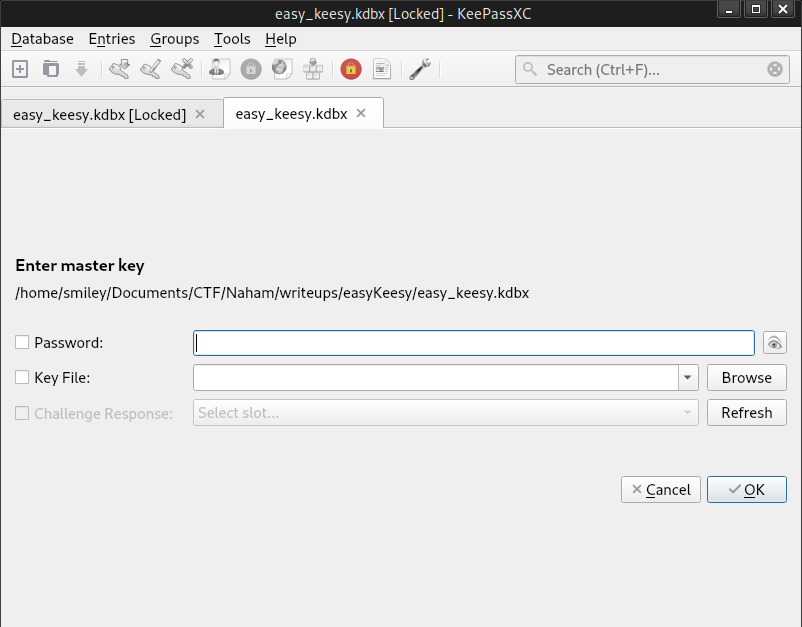

 

&nbsp;&nbsp;In this challenge first i downloaded the `easy_keesy` file. i don't know what type of file is this so i used `file` cmd to identity the file type, it's shows `KDBX` database file. Then i googled to know about `KDBX` after i understand about that files ( it's a database file with password protected and we can crack the password using `john`). first i extracted the hash for the password using `keepass2john` tool then i cracked the hash using hashcat with rockyou.txt wordlist, after 2-3 min it shows the password `monkeys`. using this password i opened easy_keesy.kdbx file in `KeePassXC` tool. Here is our flag :-). 

  
  
  
<b>Flag : </b>flag{jtr_found_the_keys_to_kingdom}
