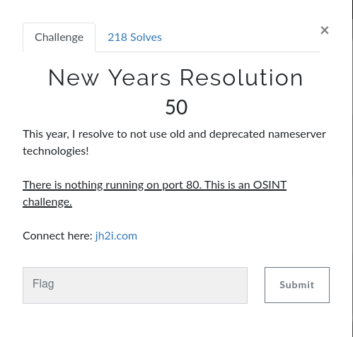
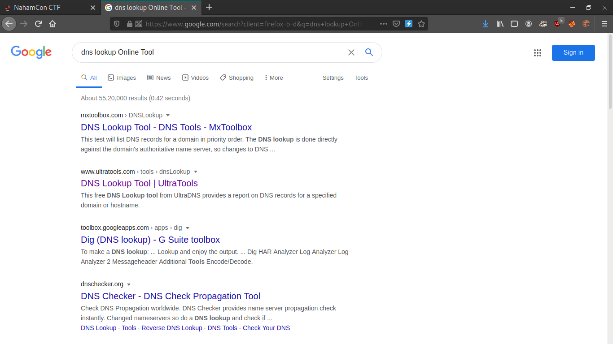
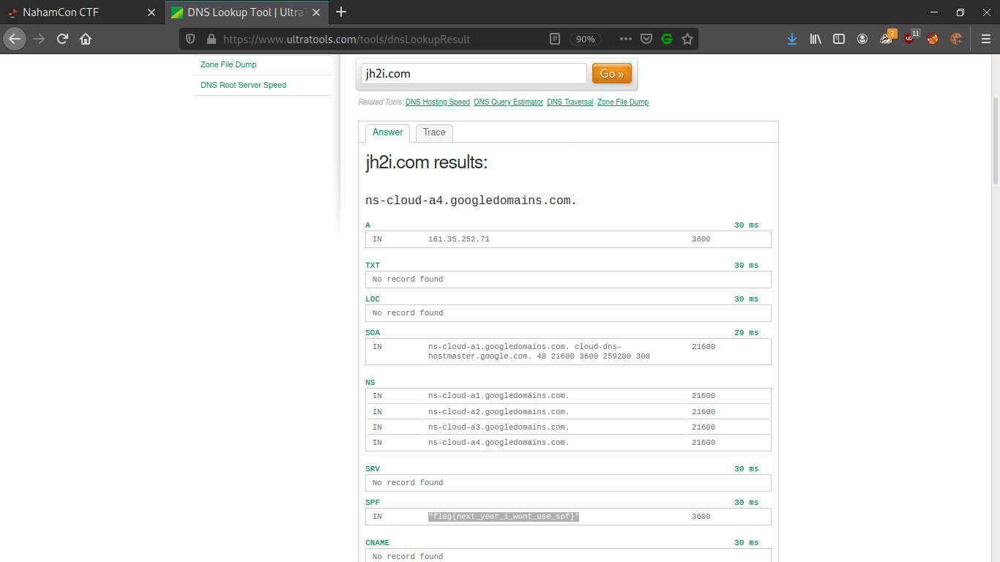

 

&nbsp;&nbsp;This is OSINT challenge, and here our hint is j2bh.com domain name. Then i thought to see the records for the domain. so used to online tool to extract all records for given domain name, there flag is in spf record. 

  
  
<b>Flag : </b>flag{next_year_i_wont_use_spf}
