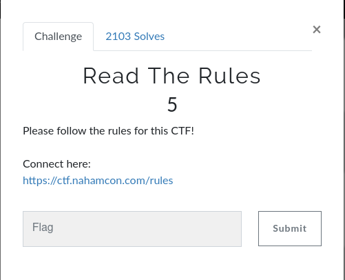

*Challenge :* `Read The Rules`
*Catagory :* `Warmup`
*Points :* `5`

    It's simple challange, here the challange name gives a hint and also they provided rules page link. so try find the flag in rules pages Oops it's not in there, so simply viewed the source code here i find the flag in the comments.

`Flag : ` [flag.txt]
