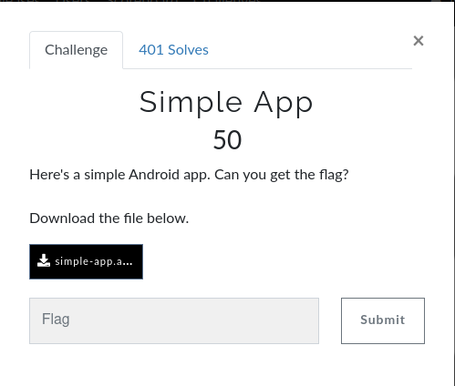
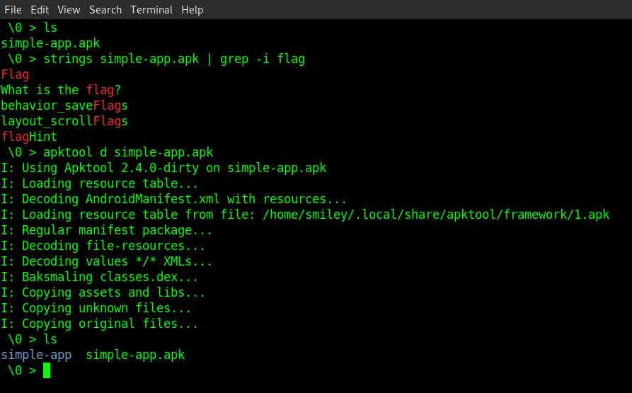
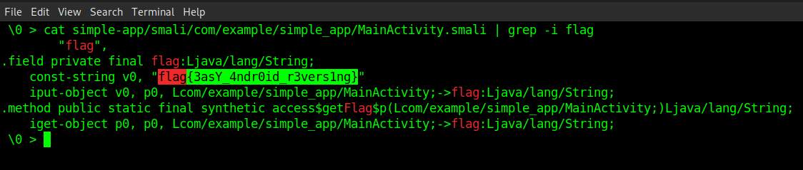

 

&nbsp;&nbsp;First i checked strings cmd it doesn't give flag so i used apktool to reverse the .apk file after that i viewed MainActivity file, here is our flag ;-). 

  
  
<b>Flag : </b>flag{3asY_4ndr0id_r3vers1ng}
